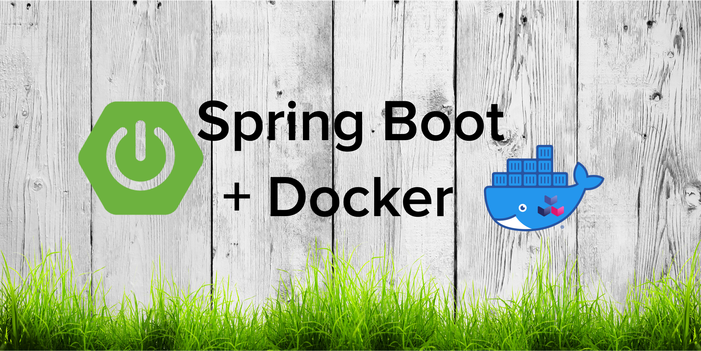

```


# Despliegue Automatizado de Base de Datos PostgreSQL con Docker

Este repositorio contiene un conjunto de archivos y configuraciones para desplegar y configurar una base de datos PostgreSQL utilizando Docker y Docker Compose.

## Descripción

El objetivo principal de este proyecto es proporcionar un entorno preconfigurado de PostgreSQL utilizando Docker, permitiendo la automatización del despliegue y la inicialización de la base de datos con scripts SQL predefinidos asimismo la automatizacion en la generación y exportación de logs y backups.

## Configuraciones y Scripts Iniciales

- **docker-compose.yml**: Archivo de configuración Docker Compose para crear y ejecutar el contenedor de PostgreSQL.
- **init-scripts/**: Carpeta que contiene los scripts SQL de inicialización de la base de datos.
  - `00 - SCHEMA AND ROL.sql`: Script para la configuración de SCHEMAS y ROLES.
  - `01 - UTILS.sql`: Script para ...
  - `02 - ARTICLE.sql`: Script para ...
  - `03 - BUSINESS_PARTNER.sql`: Script para ...
  - `04 - DOCUMENT_P0.sql`: Script para ...
  - `05 - DOCUMENT_P1.sql`: Script para ...
  - `06 - DOCUMENT_P2.sql`: Script para ...
- **configurations**: Archivo con scrips en bash, para configurar y automatizar la generacion de logs y backups de PostgreSQL.

## Configuracion del Entorno

1. **Clonar el Repositorio**
    ```bash
        git clone https://github.com/luis122448/smart-shell-postgres.git
    ```

2. **Ingresar al directorio del proyecto**

    ```bash
        cd smart-shell-postgres
    ```

3. **Ejecutar el script de instalación**
  
    ```bash
        sudo bash dev-install.sh
    ```

4. **Defina las credenciales en el archivo .env**

    ```bash
        nano .env
    ```

    ```env
        POSTGRES_USERNAME=''
        POSTGRES_PASSWORD=''
        POSTGRES_DATABASE=''
    ```

5. **Crear (si no existe) el network**

    ```bash
        sudo docker network create smart-shell-net
    ```

## Scripts

El directorio `init-scripts` contiene los scripts que se ejecutarán al iniciar el contenedor, para crear la base de datos, los esquemas, las tablas y los datos iniciales.

## Despliegue en Producción

Para el despliegue en producción se ha utilizado Docker y Docker Compose, puede revisar el archivo docker-compose.yml para conocer los detalles de la configuración.
Asimismo no se olvide de modificar las variables de entono, en asi archivo .env

1. **Ejecutar el script de despliegue**
  
    ```bash
        sudo bash deploy.sh
    ```

## Revisión del Despliegue

1. **Verificar logs y backups**
    Verificar los registros y respaldos generados durante el arranque del contenedor dentro del directorio de tu proyecto:

    ```bash
        smart-shell-postgres/
        ├── logs/
        │   ├── init-2023-12-02.log
        │   └── log-2023-12-02.log
        ├── backups/
        │   └── backup-20231202_134657.sql
        └── ...
    ```

2. **Conexion a la Base de Datos**
    ```bash
        sudo docker exec -it smart-shell-postgres bash
    ```

3. **Verificando las versiones**

    ```bash
        psql --version
        postgres --version
    ```

4. **Ingresando con el usuario condigurado**

    ```bash
        psql -U <usuario> --password --db smart_shell
        <password>

        SET search_path TO SMART_SHELL;

        SELECT * FROM TBL_ARTICLE;
    ```

## Personalización
Puedes personalizar este entorno modificando los scripts SQL en init-scripts/ según las necesidades específicas de tu base de datos. Recuerda mantener el orden numérico en los nombres de los scripts si necesitas un orden específico de ejecución.

## Contribuciones
Las contribuciones son bienvenidas. Siéntete libre de mejorar este proyecto, agregar nuevas características o corregir problemas identificados. Para contribuir, crea un Pull Request o abre un Issue.

## Licencia
Este proyecto está bajo la licencia MIT License.
```
